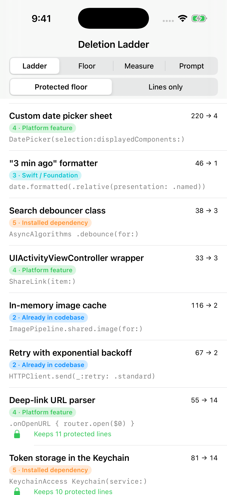
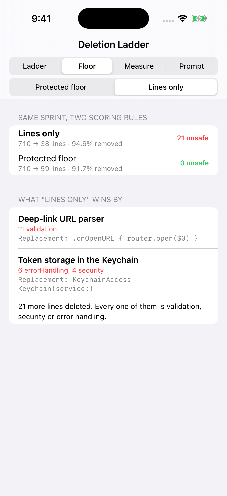
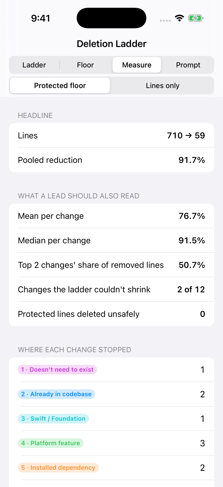

# DeletionLadder

A Swift package and iOS demo app that turns the "laziest senior dev" decision ladder into a gate you can run, with one addition the line count alone misses: **a protected floor**. The gate only removes validation, error handling, security or accessibility code when the API that replaces it does the same job.

Article: (added after publish)



## What it shows

The ladder comes from [Ponytail](https://github.com/dietrichgebert/ponytail) (MIT). Before writing code, the agent stops at the first rung that holds:

1. Does the ticket need this to exist?
2. Is it already in this codebase?
3. Does Swift or Foundation already do it?
4. Is it a SwiftUI, UIKit or App Intents feature?
5. Does a package we already depend on do it?
6. Can it be one line?
7. Only then: write the minimum that works.

`DeletionLadder` evaluates a batch of proposed changes against a catalog of things that already exist. Each change is summarised by the capability it implements and what its lines are for (`logic`, `validation`, `errorHandling`, `accessibility`, `security`). Each provider in the catalog says which protected roles it takes over: `DatePicker` brings its own accessibility, while `.onOpenURL` does not validate the URL for you.

```swift
let ladder = DeletionLadder(catalog: SampleSprint.catalog, policy: .protectedFloor)
let report = ReductionReport(ladder.evaluate(SampleSprint.changes))
// 710 → 59 lines, 0 protected lines deleted unsafely

let naive = DeletionLadder(catalog: SampleSprint.catalog, policy: .linesOnly)
ReductionReport(naive.evaluate(SampleSprint.changes)).unsafeDeletions
// 21: 11 lines of deep-link validation, 4 of Keychain access control, 6 of Keychain error handling
```

`SampleSprint` is a **constructed** set of twelve changes of the kind a coding agent writes in an iOS app. The line counts are illustrative, not measured from a real repository, so treat the numbers as a demonstration of the mechanism, not a benchmark.

| Type | What it does |
| --- | --- |
| `Rung` | The seven rungs, with the question the agent answers at each one |
| `LineRole` | What a line is for; everything except `logic` is protected |
| `Provider` / `CapabilityCatalog` | Existing APIs, the rung they sit on, call-site cost and which protected roles they cover |
| `DeletionLadder` | Stops at the first rung that holds; `FloorPolicy` decides what happens to protected lines |
| `ReductionReport` | Pooled, mean and median reduction, top-2 concentration, untouched changes, unsafe deletions |
| `PromptRenderer` | Renders the ladder and the floor as a rule block for `AGENTS.md` / `CLAUDE.md` |

Three design decisions carry the weight:

- **Coverage is per role, not per change.** A replacement can take over accessibility and still leave validation to you.
- **Code the ticket never asked for goes entirely**, protection included, because what it protected goes with it. That isn't counted as an unsafe deletion.
- **The projection never exceeds what the agent wrote.** If the call site plus the floor costs more than the original, the original was already the minimum.

## Screenshots

| Ladder | Floor (lines only) | Measure |
| --- | --- | --- |
|  |  |  |

## How to run it

```bash
git clone https://github.com/rajatslakhina/deletion-ladder-article-demo.git
cd deletion-ladder-article-demo
open Demo.xcodeproj
```

Pick an iPhone Simulator, then Build & Run (⌘R). The app consumes the package through a local package reference, so there's nothing else to set up.

Run the library tests with:

```bash
swift test
```

## Verification status

- `swift build -Xswiftc -warnings-as-errors` and `swift test` (15 XCTest cases) pass on Swift 6.1.2 on Linux, and on macos-15 in GitHub Actions.
- The Simulator screenshots above are taken by CI ([`Scripts/simulator-screenshots.sh`](Scripts/simulator-screenshots.sh)): it builds `Demo.xcodeproj` with `xcodebuild`, installs the app on an iPhone Simulator, launches it once per tab, checks the process is still alive after 8 seconds and saves a screenshot. They were not taken by hand on a Mac.

## License

MIT
